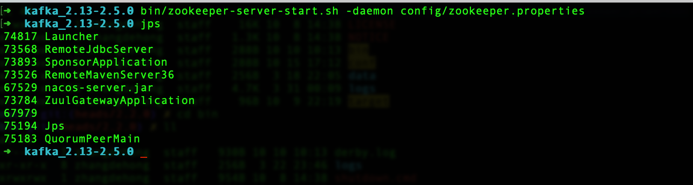
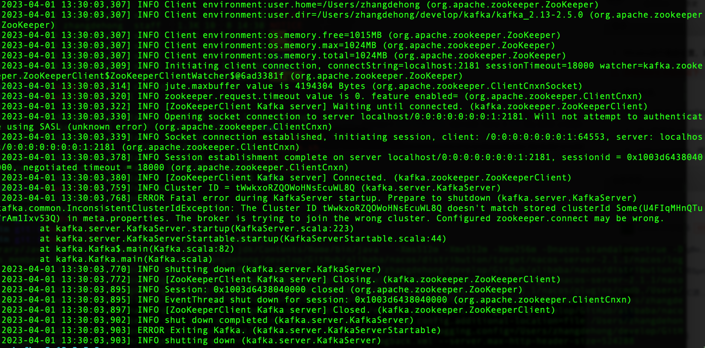
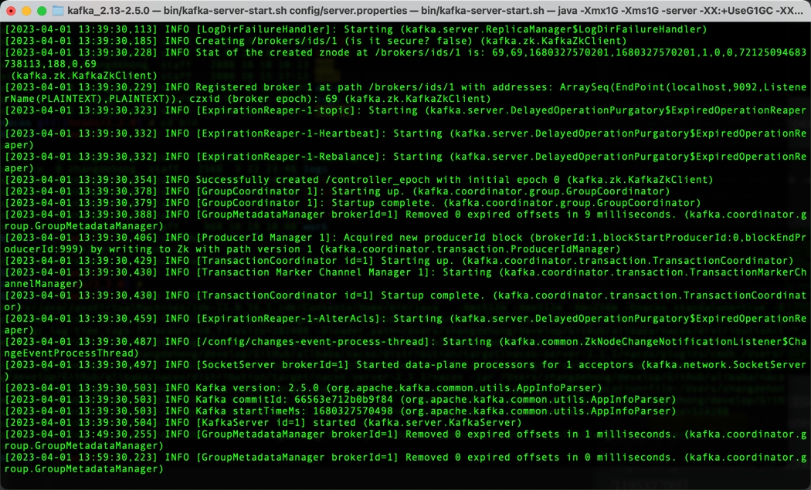
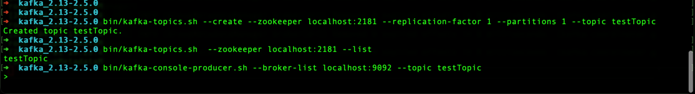
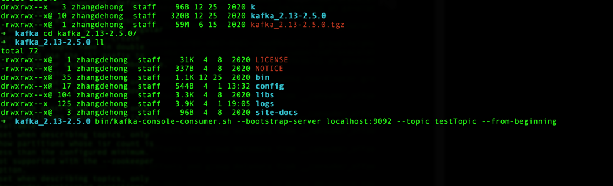
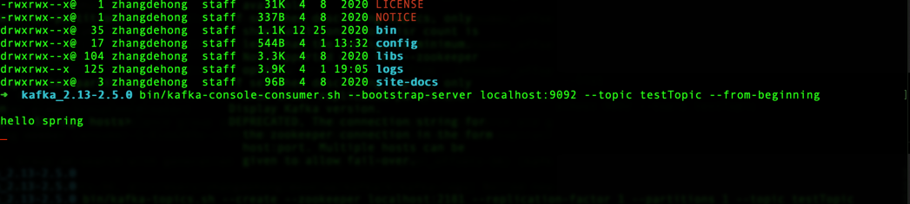

1.下载https://kafka.apache.org/[kafka]

2.启动kafka

    1.启动zookeeper
    进入kafka文件目录 bin/zookeeper-server-start.sh -daemon config/zookeeper.properties

QuorumPeerMain 说明zookeeper启动成功

    2 启动kafka
        bin/kafka-server-start.sh -daemon config/kafka.properties

如果提示如图所示错误信息，找到log目录所在的文件，在##meta.properties##修改cluster.id为错误提示中的即可
参考：https://blog.csdn.net/m0_59252007/article/details/119533700[]

kafka启动成功

3.创建topic

    bin/kafka-topics.sh --create --zookeeper localhost:2181 --replication-factor 1 --partitions 1 --topic testTopic

查看创建的topic

    bin/kafka-topics.sh  --zookeeper localhost:2181 --list

4.启动product和consumer

    1>.启动product
    bin/kafka-console-producer.sh --broker-list localhost:9092 --topic testTopic

    2>.启动consumer  from-beginning表示从头开始读
    bin/kafka-console-consumer.sh --bootstrap-server localhost:9092 --topic testTopic --from-beginning

    3>.product的消息发送和consumer的消息消费

5.topic信息的查看

    bin/kafka-topics.sh --describe --zookeeper localhost:2181 --topic testTopic

